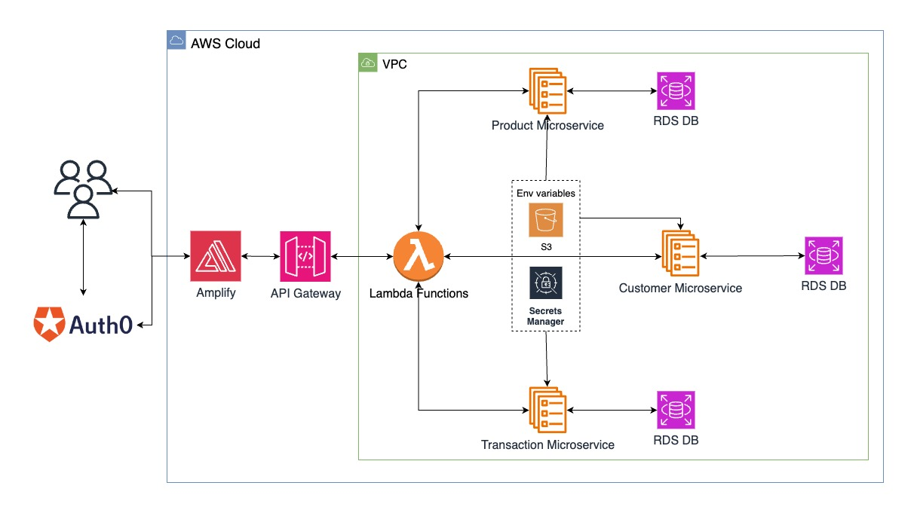

# Inventory Management System (IMS) - Monorepo

<a href="https://main.d1uzi70v0t0f8v.amplifyapp.com/" target="_blank">Live link</a> of the project.

## 🏗️ About the Project

The system follows a **microservices-based, backend-heavy, frontend-friendly architecture**, designed to maintain a scalable and reliable inventory and transaction system. The **main goal** of this project was to learn and apply various industry-standard technologies like microservices, cloud services, Auth0 security, containerization, and cloud deployment.

This project is a **monorepo** containing all microservices and frontend related to the Inventory Management System (IMS). The development of individual services was done in separate repositories, which are now linked as submodules in this monorepo.

### Features

- **Inventory Management**: Users can maintain and update their product inventory.
- **Customer and Transaction Management**: Users can add customers and maintain transactions.
- **Data Consistency**: Users cannot disable products or customers involved in transactions, ensuring data integrity.
- **Atomic Transactions**: Transactions are atomic, meaning they are either fully completed or not at all, ensuring data consistency.
- **Transaction-Based Updates**: Product quantity and average buy rate are updated only through transactions.
- **Minimalistic Design**: The UI design is kept simple for the initial phase, with little emphasis on aesthetics.
- **Advanced Search Filters**: Users can search transactions based on filters like:
  - All
  - Buy
  - Sell
  - Customer-specific
  - Product-specific
  - Date range filtering

## 🛠️ Tech Stack

- **Backend**: FastAPI and SQLModel (built on top of Pydantic and SQLAlchemy)
- **Database**: AWS RDS (PostgreSQL)
- **Frontend**: React with TypeScript
- **Security**: OAuth2.0 by Auth0
- **Containerization**: Docker
- **Image Repository**: AWS ECR (Elastic Container Repository)
- **Container Orchestration**: AWS ECS (Elastic Container Service)
- **Environment Variables Management**: AWS S3 for .env file and AWS Secrets Manager for storing credentials
- **API Composition**: AWS Lambda Functions
- **API Gateway**: AWS API Gateway

The project adheres to industry-standard coding practices, including:

- Use of type annotations throughout the codebase for better readability and type safety.
- Validators are used to parse the input into respective classes and validate the content coming in the requests
- Modular programming and recommended folder structure to reuse the components as much as possible.
- Separation of configuration (e.g., authentication and database credentials) using environment variables for security and flexibility.

## 🚀 Project Architecture

This system is built on a microservices architecture, with backend services handling the majority of the business logic and APIs, while the frontend serves as the user interface.

1. **Microservices**:

   - **Product Service**: Handles all CRUD operations related to products in the inventory.
   - **Customer Service**: Manages customer data and allows user operations like adding, deleting or viewing customers.
   - **Transaction Service**: Handles transaction records. Updates to product quantity and average buy rate can only happen through a transaction to maintain data consistency.

   Each microservice is containerized and run as a service on ECS and uses environment variables and .env files from **AWS S3** and **AWS Secrets Manager**.

2. **Databases**:
   Each microservice has its own dedicated database in **AWS RDS (PostgreSQL)**. This ensures separation of concerns and scalability.

3. **API Composition with Lambda**:
   **AWS Lambda Functions** act as intermediaries for complex API requests. They perform **API Composition** by calling multiple microservices, especially when a request requires data from more than one service.

4. **Service Discovery & VPC**:
   All lambda functions, services and databases are hosted in an **AWS VPC (Virtual Private Cloud)**. Services communicate internally via internal DNS names using **AWS Service Discovery**, ensuring secure and reliable communication.

5. **API Gateway & Security**:
   The **AWS API Gateway** is used to expose public endpoints, all secured using **Auth0 OAuth2.0**. Every API request passes through the API Gateway, where the **access token** is validated. This access token is further validated at each service endpoint to ensure consistent security.

6. **Frontend**:
   The frontend is built using **React with TypeScript** and is deployed on **AWS Amplify**. It connects with the API Gateway using its public endpoints and interacts with backend services through the API.

## 📑 Future Work

1. **UI/UX Enhancements**:

   - Beautifying the design and making it more user-friendly using CSS and additional styling components.

2. **New Features**:

   - **Recording Payments**: Add functionality to record payments made by customers.
   - **Advanced Customer & Product Records**: Add more details and customization options for customers and products.
   - **Error Handling**: Make the system more fault-tolerant by adding failure checks at various points in the services.

3. **CI/CD Pipeline**:
   - Implementing a full CI/CD pipeline for continuous integration and deployment using AWS services and GitHub Actions.
